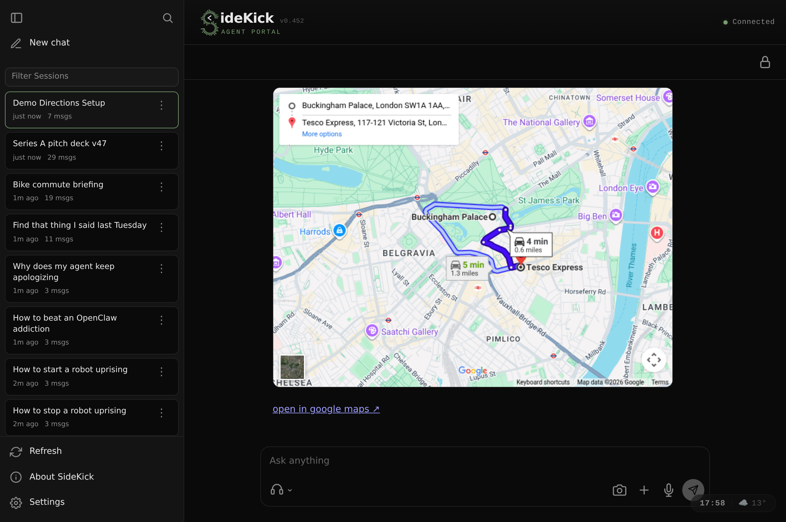
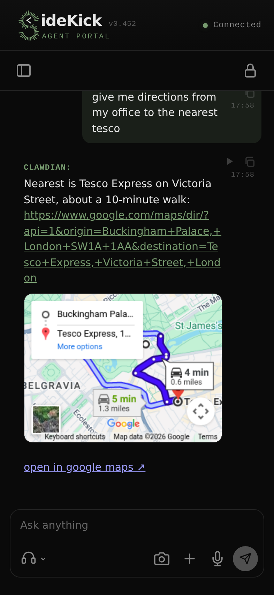

# Sidekick

**A voice-first agent portal — bring your own backend.**

Hands-free chat with any agent that speaks the OpenAI Responses API. Configurable STT + TTS (Deepgram, ElevenLabs, OpenAI Whisper — easy to add others), lockscreen-friendly background audio for in-pocket use, WhatsApp-style voice memos, streaming voice keyboard, and full hands-free calling via WebRTC. Installable PWA shell that runs on anything from a Raspberry Pi to a cloud server.

<p align="center">
  
  &nbsp;&nbsp;
  
</p>

## Install

```bash
curl -fsSL https://raw.githubusercontent.com/jscholz/sidekick/master/install.sh | bash
```

Clones into `./sidekick` in your current directory, installs deps, and boots:

- Sidekick proxy on `http://localhost:3001` (open this in a browser)
- Bundled stub agent on `:4001` (echo LLM, no API keys needed)

Add a [Deepgram](https://console.deepgram.com) key to `./sidekick/.env` to enable voice; everything else is optional.

Manual install:

```bash
git clone https://github.com/jscholz/sidekick.git
cd sidekick
cp .env.example .env
npm install
npm start
```

### Agent self-install

**Wiring up your own agent backend?** Sidekick ships with [`AGENTS.md`](AGENTS.md) — a short context file aimed at AI coding assistants (Claude Code, Cursor, Aider, ...). Open the cloned repo in your assistant of choice and say *"set sidekick up against my agent"*; the file gives it everything it needs (the contract, where to write the adapter, how to test).

## What's different

Most chat UIs treat voice as a bolt-on. Sidekick is voice-first:

- **Two handsfree modes** — turn-based (record-then-send) and realtime (full-duplex WebRTC). User picks per session.
- **Background-audio survival** — PWA stays alive on iOS lockscreen so you can talk to the agent while your phone is in your pocket. Pocket-lock overlay absorbs touches; mic + TTS + barge-in keep working.
- **Barge-in** — interrupt the agent mid-sentence by speaking. Client-side Silero VAD + per-device tuning.
- **Per-bubble TTS replay** — every agent reply has a play button. BT headset skip-fwd/back navigates between replies.
- **Bring your own agent** — speaks the OpenAI Responses API (`/v1/responses`, `/v1/conversations/*`). Drop-in compatible with any server that does, plus richer plugins for Hermes (and openclaw, soon).
- **Extensible right drawer** — Pins and Activity share an internal module host, so future surfaces such as notifications, artifacts, or editor canvases can plug into the same right-side rail. See [Right Drawer Modules](docs/RIGHT_DRAWER_MODULES.md).

## Frontends

| Frontend | Status | Notes |
|---|---|---|
| **Desktop browser** | ✅ Stable | Full feature set. Chrome / Edge / Safari / Firefox. Open `http://localhost:3001` and go. |
| **Mobile PWA** | ✅ Stable | Installable web app — "Add to Home Screen" on iOS / "Install app" on Android adds an icon that launches like a native app, no app-store install required. Fastest way to try Sidekick on a phone. Most features work; backgrounding is best-effort (browsers can suspend mic when the screen locks), and the browser re-asks for mic permission on each cold launch. |
| **iOS / Android native** | 🚧 Coming soon | Capacitor wrapper to fix the mic-permission and background-audio gaps the PWA can't. |

## Backends

| Backend | Status | Use when |
|---|---|---|
| **stub** (in-tree) | ✅ Built-in default | First-clone demos, hermes-free dev, CI smoke runs. Echo / Gemini / Ollama LLM adapters. See [`backends/stub/README.md`](backends/stub/README.md). |
| **Hermes** | ✅ Bundled plugin | Full-featured agent — sessions, multi-platform drawer (Telegram/Slack/WhatsApp surface alongside sidekick), tool-call activity rows, attachment auto-routing through auxiliary vision. See [`backends/hermes/README.md`](backends/hermes/README.md). |
| **openclaw** | ✅ Bundled plugin | Full sidekick contract: drawer, responses streaming, events, push, pins, unread. Reuses the same `sidekick.db` schema as the hermes plugin. See [`backends/openclaw/README.md`](backends/openclaw/README.md). |
| **Any `/v1/responses`-compatible server** | ✅ Point `SIDEKICK_PLATFORM_URL` at it | OpenRouter, LMStudio, your own — see [`docs/ABSTRACT_AGENT_PROTOCOL.md`](docs/ABSTRACT_AGENT_PROTOCOL.md) for what's required vs. optional. |

## Configure

Two surfaces:

- **`.env`** — secrets (Deepgram, optional API keys). See [`.env.example`](.env.example).
- **`sidekick.config.yaml`** — non-secret deployment tuning (branding, theme, preferred-models filter, server ports). See [`example.sidekick.config.yaml`](example.sidekick.config.yaml). Point sidekick at it via `SIDEKICK_CONFIG=/path/to/file`.

The Settings panel inside the app handles per-user preferences (theme, mic device, TTS voice, STT keyterms, etc.) live without restart.

## API + state surface

A map of where data lives, and which endpoints touch it. Use this when
debugging "where does X get stored" or "who's writing this value".
Backend-specific details (table columns, env vars, native-store reads)
live in each backend's README — this section is the cross-tier overview.

### Endpoint surface

**Backend contract (`/v1/*`)** — the HTTP+SSE surface every backend
must speak. Sidekick proxy forwards these unchanged (with auth-header
injection).

| Endpoint | Purpose |
|---|---|
| `POST /v1/responses` | Send a turn; receive SSE stream (`reply_delta`, `reply_final`, `tool_call`, `tool_result`) |
| `GET /v1/conversations` | Drawer list — chat metadata for sidebar |
| `GET /v1/conversations/{id}/items` | Transcript replay for a chat |
| `PATCH /v1/conversations/{id}` | Rename chat |
| `DELETE /v1/conversations/{id}` | Delete chat + history |
| `GET /v1/events` | Out-of-band SSE (notifications, `session_changed`, cron output, `unread_changed`, `pins_changed`) |
| `POST /v1/push/subscribe` / `unsubscribe` | WebPush registration |
| `GET /v1/push/vapid-public-key` | VAPID identity for browser subscribe |
| `GET /v1/push/mutes` / `POST /v1/push/mute` | Per-chat push mute |
| `GET /v1/push/prefs` / `POST /v1/push/prefs` | Quiet-hours + per-kind enables |
| `POST /v1/push/visibility` | PWA visibility heartbeat (push-eligibility gate) |
| `POST /v1/push/test` | Self-test ping |
| `GET /v1/unread` | Per-chat unread counts (SSOT for app badge + sidebar) |
| `POST /v1/unread/seen` / `mark` | Mark seen / sticky-unread |
| `GET /v1/pins` / `POST /v1/pins` / `DELETE /v1/pins/{chat}/{msg}` | Cross-device pin sync |
| `GET /v1/health` | Liveness probe |

Optional extensions (hermes implements; openclaw partial):
`/v1/gateway/conversations`, `/v1/settings/*`, `/v1/commands`,
`/v1/conversations/search`.

**PWA-facing convenience routes (`/api/sidekick/*`)** — proxy
translates between PWA and backend, normalizing shapes:

| Route | Forwards to |
|---|---|
| `/api/sidekick/notifications/*` | `/v1/push/*` + `/v1/unread/*` |
| `/api/sidekick/pins/*` | `/v1/pins/*` |
| `/api/sidekick/stream` | proxy's own SSE fan-out over `/v1/events` |
| `/api/sidekick/config` | proxy-owned YAML deployment config |

### State tiers

Four tiers. Higher tiers are caches/scaffolding; the SSOT lives at the
backend plugin or backend native layer.

**Tier 1: PWA (per-device, browser)** — render scaffolding +
per-device prefs. Not authoritative.

- IndexedDB stores (12 total): `sidekick.pins`, `sidekick.unread`,
  `sidekick-conversations`, `sidekick-scroll`, `sidekick-sessions`,
  `sidekick-voice-memos`, `sidekick-keyterms`, `sidekick-chat`,
  `sidekick-outbox`, `sidekick.cmdk`. Most are render-scaffolding
  caches; re-fetched from server when stale.
- localStorage: `sidekick.settings.v2` (most user prefs), per-device
  keys (`micDevice`, `ttsVoiceLocal`, `listenSttEngine`).
- In-memory caches: pin store + unread set + mute set (all mirror
  server), draft buffer, rendered-message dedup map (`renderedMessages`),
  scroll-position cache, model catalog.

**Tier 2: Proxy (`server.ts` + `proxy/`)** — forwarding + expensive-
sub-render caches. Mostly stateless after the 2026-05 consolidation.

- In-memory: SSE subscriber set + recent event ring (128 entries),
  per-chat last-broadcast timestamps, screenshot / render / link-
  preview caches (1h TTL each).
- On disk: `sidekick.config.yaml` (deployment tuning, branding,
  theme). Optional `SIDEKICK_CONFIG` override.
- **Dead weight when plugin owns it**: `proxy/sidekick/inflight.ts`
  is bypassed when `SIDEKICK_INFLIGHT_OWNED_BY_PLUGIN=true`; push
  storage in `proxy/sidekick/notifications/{storage,mutes,prefs}.ts`
  (legacy JSON in `~/.sidekick/notifications/`) is bypassed when
  `SIDEKICK_PUSH_OWNED_BY_PLUGIN=true`. Both env flags default to
  true in deployed units.

**Tier 3: Backend plugin (supplemental sqlite `sidekick.db`)** —
SSOT for sidekick-specific concerns. Same schema in both backends.

| Table | Purpose |
|---|---|
| `msg_links` | In-flight PWA-minted `msg_*` id → backend native row-id bridge |
| `pins` | Pinned messages per chat (role, text, timestamps) |
| `unread_state` | Per-chat read pointers + sticky-unread flag |
| `push_subscriptions` | WebPush endpoints (endpoint, p256dh, auth, userAgent) |
| `push_mutes` | Per-chat push mute state |
| `push_prefs` | Global push preferences (quiet-hours, per-kind enables) |
| `vapid_keys` | WebPush VAPID identity (singleton row, lazy-imported from env on first run) |
| `meta` | Schema version tracking |

Per-process in-memory state inside the plugin: `TurnBuffer` (mid-
flight transcript mirror), `EngagementState` (2s push-eligibility
window), SSE subscriber set, event replay ring. See backend READMEs
for plugin-specific details + module locations.

**Tier 4: Backend native (read-only by the plugin)** — the agent
runtime's own transcript + session store.

- **Hermes**: `state.db` sqlite — sessions, messages, tool calls.
  Plugin reads via recursive CTEs (compaction-rotated session chains
  roll up under their root `user_id`). See [`backends/hermes/README.md`](backends/hermes/README.md).
- **OpenClaw**: `sessions.json` + `{sessionId}.jsonl` files on disk.
  Plugin reads directly. See [`backends/openclaw/README.md`](backends/openclaw/README.md) for details.

### Decisions cemented in the 2026-05 consolidation

Before the OpenClaw integration we audited the state surface and found
~25 distinct places holding state. The consolidation goals:

- **SSOT per concern**: badges, push eligibility, pins are server-
  driven. PWA is a read-through cache only — fixes drift bugs (app
  badge says 7, sidebar empty).
- **Per-backend supplemental DB**: one `sidekick.db` per backend
  profile. No cross-backend bleed (one user → one backend in
  production; running both at once is dev-only).
- **VAPID keys lazy-imported, then plugin-owned**: env vars
  (`VAPID_PUBLIC_KEY`, `VAPID_PRIVATE_KEY`) bootstrap on first run;
  subsequent reads come from `vapid_keys` table. Survives env-var
  rotation.
- **Cross-device sync rides the SSE stream**: plugin emits
  `unread_changed`, `pins_changed`, and `conversation_deleted`
  envelopes; all connected PWAs re-fetch the affected surface.
  Debounce per-surface: 1500ms on unread refresh (the surface most
  prone to burst envelopes from cron / multi-chat reply_final), 800ms
  on pins (user-initiated singletons), immediate for deletes.
- **Env flags fence the migration**: `SIDEKICK_PUSH_OWNED_BY_PLUGIN`
  + `SIDEKICK_INFLIGHT_OWNED_BY_PLUGIN`. Old proxy-side push storage
  + inflight cache still exist as fallback for backends that haven't
  migrated yet.

### What got consolidated (before → after)

| Concern | Before | After |
|---|---|---|
| Push subs/mutes/prefs | 3 JSON files in `~/.sidekick/notifications/` + 1 in-memory cache each (proxy) | 3 plugin DB tables + 1 in-memory cache each (per backend) |
| Unread state | 1 IDB store (`sidekick.unread/kv`) + in-memory PWA Map (authoritative locally) | 1 plugin DB table + read-through PWA cache (server authoritative) |
| Pins | 1 IDB store (`sidekick.pins/items`) + in-memory PWA Map (authoritative locally, no cross-device) | 1 plugin DB table + read-through PWA cache (server authoritative, cross-device sync) |
| In-flight turn buffer | Proxy `inflight.ts` cache only (hermes-specific by accident) | Plugin `TurnBuffer` in both backends; proxy cache vestigial under env flag |
| VAPID identity | Env vars only (bootstrap fragile to rotation) | Plugin `vapid_keys` table (lazy import from env once, then DB) |

Net effect: SSOT moved DOWN one tier (PWA → plugin). PWA + proxy
became read-through caches / forwarders. Cross-device sync works
for everything. One backend = one `sidekick.db`.

## Documentation

| Doc | What's in it |
|---|---|
| [Agent contract](docs/ABSTRACT_AGENT_PROTOCOL.md) | The `/v1/*` HTTP+SSE surface a backend MUST implement. Read before forking the proxy or implementing a new backend. |
| [Audio bridge protocol](docs/SIDEKICK_AUDIO_PROTOCOL.md) | WebRTC data-channel events, dispatch path, listening / barge envelopes. Read before forking `audio-bridge/`. |
| [Architecture](docs/ARCHITECTURE.md) | System diagram, module tree, endpoint inventory. |
| [Canvas protocol](docs/CANVAS.md) | Inline card envelopes (link previews, YouTube embeds, image grids). |
| [Barge-in](docs/BARGE.md) | Detection algorithm, knobs, file map. Read before tuning sensitivity or debugging false-fires / missed-fires. |
| [Backend READMEs](backends/) | One per backend — install steps, contract pieces implemented, **backend-specific state details**. |

## Contributing

See [`CONTRIBUTING.md`](CONTRIBUTING.md) for dev setup, test commands, and code style. Contributors using AI coding assistants should also read [`AGENTS.md`](AGENTS.md).

## License

MIT — see [`LICENSE`](LICENSE).
